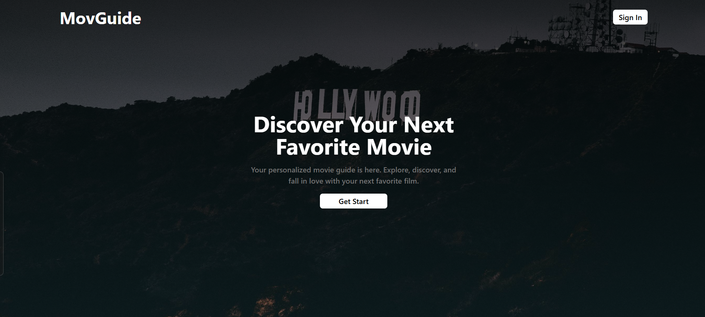

# MOVIES DATABASE 


### This website is a movie database that fetches data from [DummyAPI](https://dummyapi.online/api/movies) and displays it in an interactive table. Users can explore movie titles, ratings, and IMDb links, all organized for easy navigation.

## Technologies Used
- **ReactJS**
- **TailwindCSS**
- **React-icons**

## Features
- **Easy Navigation:** Browse through the movie collection effortlessly.
- **Pagination:** Explore movies in a paginated format, default 10 movies per page.
- **Interactive Table:** View detailed movie titles, ratings, and direct IMDb links in an organized table.
- **Dynamic Data:** Fetches real-time data from DummyAPI.
- **Responsive Design:** Optimized for all screen sizes for a seamless experience.
- **User-Friendly Interface:** Simple and intuitive layout for quick access to information.

## The Setup and Launch Process

Follow these steps to set up and launch the application locally:

### Step 1: Clone the repository

Clone the repository to your local machine:

```bash
git clone https://github.com/Sajid941/Task-Management.git
```
### Step 2: Install Dependencies
Navigate to the project directory and install the necessary dependencies:


```bash
cd <project-directory>
npm install
```
### Step 3: Run The Application
Start the application by running:

```bash
npm run dev
```

